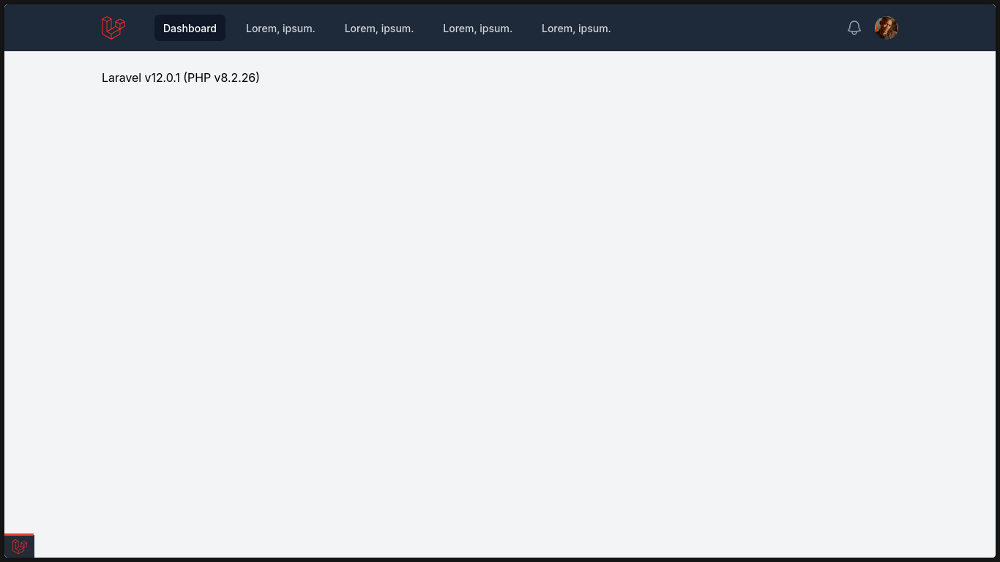

[](https://github.com/SantosVilanculos/laravel/actions)
[](https://github.com/SantosVilanculos/laravel/blob/main/LICENSE)



```sh
chmod +x ./install.sh && ./install.sh
```

```sh
composer run dev
```
